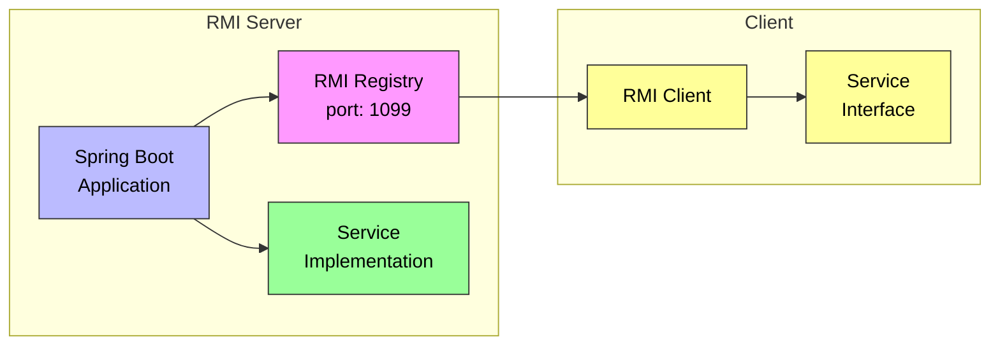

## Setup Instructions

### Server

After having moved a zipped jar file to remote VM and unzipping it, we do the following:

```
# start rmi registry
cd rmi/src
rmiregistry &

# compile server
java -cp out hotel.BookingServer
```

### Client

In the main class of the client, we have to specify host IP address.

```
Registry registry = LocateRegistry.getRegistry("IP.ADD.RE.SS");
```

Locally, we have to compile the client and subsequently, send requests.

```
javac -d out -sourcepath src src/staff/BookingClient.java

java -cp out staff.BookingClient
```
