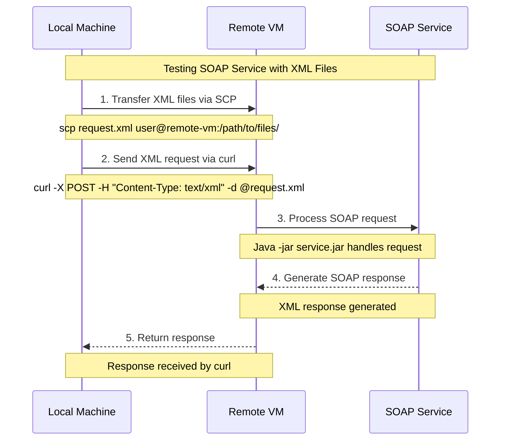

To test SOAP service using XML files, we can use `curl`.

```
curl --header "content-type: txt/xml" -d @requestfile.xml http://IP.ADD.RE.SS:8081/ws
```

Sending and processing sent requests is illustrated in the sequence diagram below.


